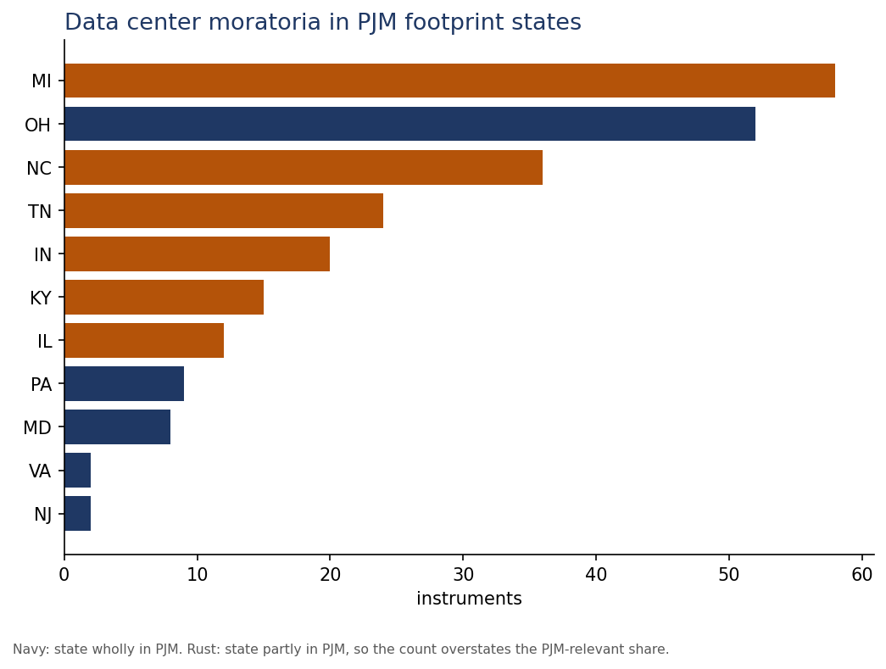
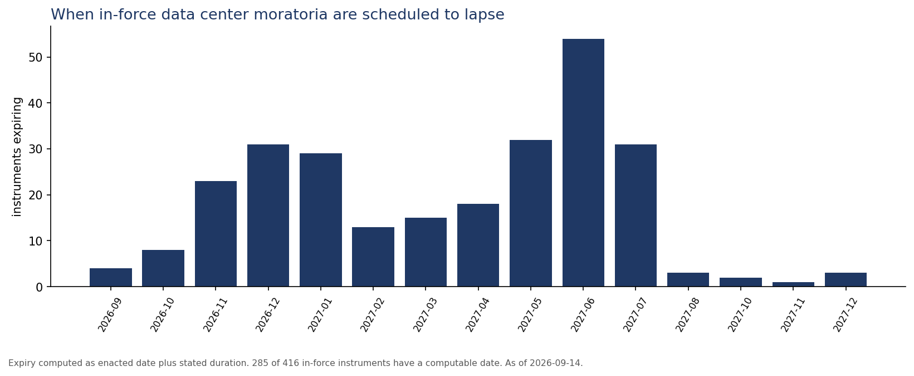

# Findings

Generated from `data/tracker.db` by `scripts/report.py`. As of September 14, 2026.

Underlying data: Moratorium Nation (Bommarito, 2026), CC-BY-4.0. The analysis and the
two derived columns below are this project's contribution.

---

## 1. Nearly half of U.S. data center moratoria sit in PJM footprint states

238 of 505 data-center moratorium instruments (47%) are in
states wholly or partly inside PJM. Restricting to states entirely within the footprint
still gives 73 instruments.

This is not a coincidence and it is not published anywhere. Moratorium datasets are
organized by state because that is how local government works. Grid planning, load
forecasting, and capacity procurement are organized by RTO. Nobody has mapped one onto the
other, which means nobody has asked the obvious follow-up: what does the densest
concentration of local siting restrictions in the country do to the load forecast of the
RTO underneath it?

| State | In force | Total instruments | Footprint |
|---|---|---|---|
| MI | 47 | 58 | partial |
| OH | 46 | 52 | full |
| NC | 32 | 36 | partial |
| TN | 19 | 24 | partial |
| IN | 15 | 20 | partial |
| KY | 12 | 15 | partial |
| IL | 11 | 12 | partial |
| PA | 8 | 9 | full |
| MD | 5 | 8 | full |
| NJ | 2 | 2 | full |
| VA | 1 | 2 | full |

States marked partial have only part of their territory in PJM, so their counts overstate
the PJM-relevant share. Resolving that requires mapping jurisdictions to transmission
zones, which is Phase 3 work.

---

## 2. The source dataset has almost no end dates. They are computable anyway.

Only **9 of 505** data-center rows carry a parsed end date in
`current_end_date_iso`. But **396** carry a duration in days.

Enacted date plus duration yields a usable expiry for **313
of 416** in-force instruments. That single derived column is the difference
between a dataset that describes the past and one that forecasts.

Anyone quoting duration claims straight from this dataset is quoting a column that is 98%
empty. That is worth knowing before it appears in a client deck.

---

## 3. A forward calendar of when pauses lift

285 in-force moratoria have a computed expiry still ahead of them. They do not lapse
evenly.

| Period | Instruments scheduled to lapse |
|---|---|
| 2026-09 | 4 |
| 2026-10 | 8 |
| 2026-11 | 23 |
| 2026-12 | 31 |
| 2027-01 | 29 |
| 2027-02 | 13 |
| 2027-03 | 15 |
| 2027-04 | 18 |
| 2027-05 | 32 |
| 2027-06 | 54 |
| 2027-07 | 31 |
| 2027-08 | 3 |
| 2027-10 | 2 |
| 2027-11 | 1 |
| 2027-12 | 3 |

The peak is **2027-06**, when 54 instruments are scheduled to expire at once.
That clustering follows mechanically from the mid-2026 adoption wave and standard 6 and
12 month terms, and it means a large block of jurisdictions face the same
renew-or-permanent decision in the same quarter.

For anyone modeling siting risk or load, that is a date to have on a calendar.

---

## 4. 28 instruments are listed as in force but their term has already run out

These carry `enacted_status` of active or extended, yet enacted date plus stated duration
puts expiry in the past. Each one is either an extension not yet captured, a permanent
ordinance that replaced the pause, or a stale row.

| State | Jurisdiction | Enacted | Days | Computed expiry |
|---|---|---|---|---|
| KY | Oldham County Fiscal Court | 2025-06-26 | 150 | 2025-11-23 |
| GA | Clayton County | 2025-09-03 | 120 | 2026-01-01 |
| MD | Prince George's County | 2025-09-16 | 180 | 2026-03-15 |
| CA | El Monte | 2026-03-18 | 45 | 2026-05-02 |
| GA | Brooks County | 2026-02-02 | 90 | 2026-05-03 |
| MI | Pittsfield Township | 2025-11-20 | 180 | 2026-05-19 |
| CA | Oakley | 2026-04-14 | 45 | 2026-05-29 |
| OH | City of Norton | 2025-12-01 | 180 | 2026-05-30 |
| MI | Tyrone Township | 2025-12-02 | 180 | 2026-05-31 |
| GA | Carroll County | 2026-03-03 | 100 | 2026-06-11 |
| OH | Village of Lordstown | 2026-01-05 | 180 | 2026-07-04 |
| MI | Saginaw | 2026-01-12 | 180 | 2026-07-11 |

Showing the 12 earliest of 28. This is the Phase 2 verification queue:
resolving these is exactly the cross-source reconciliation work, and it is the kind of
correction that makes a tracker citable rather than merely available.

A further **103** in-force instruments have no computable expiry at all.

---

## What this supports

- A column pitch. Items 1 and 3 are the article: the PJM concentration, and a dated
  calendar of when the pauses lift.
- Client work. The expiry calendar answers siting-risk questions directly.
- Phase 2 scope. Item 4 is the verification queue, already enumerated.
